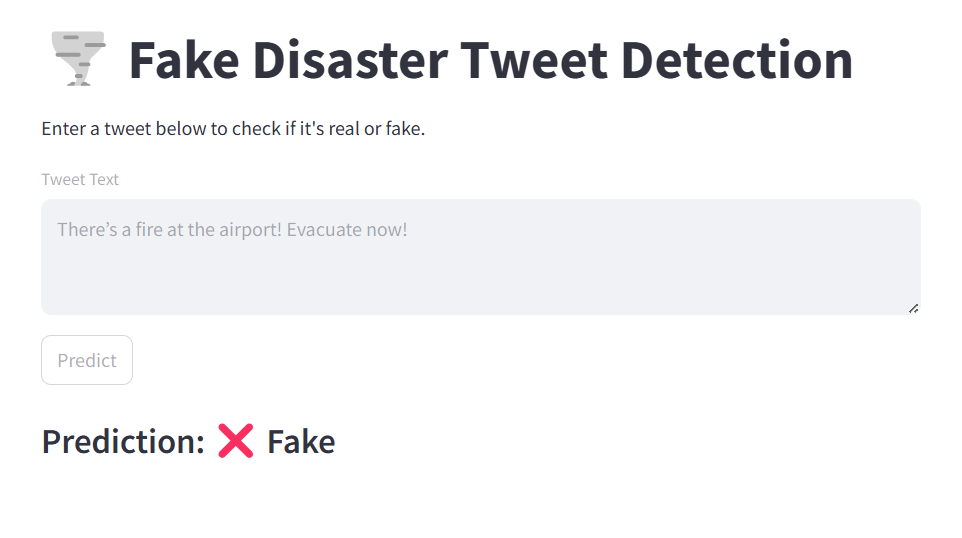

# 🌀 Fake Disaster Tweet Detection

This app uses a Machine Learning model to classify tweets as **real** or **fake** disaster alerts.

## ⚙️ Technologies Used

- Python
- Streamlit
- scikit-learn
- TfidfVectorizer + Logistic Regression

## 🖼️ Demo

 <!-- Replace with your own screenshot -->

## 🚀 How to Run

```bash
pip install -r requirements.txt
streamlit run app.py
